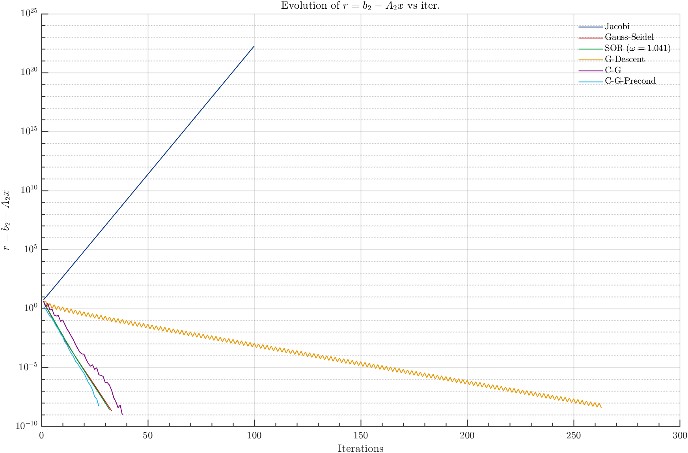

# 🧠 Modeling in Aerospace Engineering Repository

This repository contains the laboratory assignments for **Modeling in Aerospace Engineering** in the **Aerospace Engineering program** at **Universidad Carlos III de Madrid (UC3M)**. It includes problem-solving approaches, MATLAB scripts, and numerical analysis reports designed to bridge theory with computational implementation.

---

## 📑 Table of Contents
1. [Repository Structure](#-repository-structure)
2. [Project Descriptions](#-project-descriptions)
   - [Flow over a cylinder. Part I](#1-flow-over-a-cylinder-part-i-numerical-analysis-with-ansys-fluent)

3. [How to Use](#-how-to-use)
4. [Requirements](#%EF%B8%8F-requirements)
5. [Download as .zip](#-download-as-zip)
6. [Authors](#-authors)
7. [Course Information](#-course-information)
8. [Contribution](#-contribution)
9. [License](#-license)

---

## 📁 Repository Structure

```
.
├── Assignment 1 - Linear System Solvers/
│   ├── Hw_1_Modeling_AVV_SVG.pdf
│   ├── MATLAB_scripts/
│   │   ├── lu_decomposition.m
│   │   ├── gauss_seidel.m
│   │   ├── sor_method.m
│   │   ├── conjugate_gradient.m
│   │   └── residual_plot.m
```

---

## 📂 Project Descriptions

### 1. Assignment I – Solving Linear Systems: Direct and Iterative Methods

This assignment focuses on analyzing and solving large linear systems using both **direct methods** (e.g., LU decomposition) and **iterative methods** (e.g., Jacobi, Gauss-Seidel, SOR, Gradient Descent, Conjugate Gradient). Implemented in MATLAB, the objective is to evaluate the efficiency, accuracy, and convergence behavior of each method.

#### Main Objectives:

- To solve a linear system using **LU decomposition** with and without pivoting.
- To compare the performance of **iterative solvers**: Jacobi, Gauss-Seidel, and **Successive Over-Relaxation (SOR)**.
- To analyze the behavior of **non-stationary methods**, such as **Gradient Descent** and **Conjugate Gradient** (with and without preconditioning).
- To visualize and interpret the **evolution of the residual norm** across iterations.
- To identify conditions for convergence using **spectral radius** and **matrix properties**.

#### Methods Covered

- **LU Decomposition** (with Gaussian Elimination and Partial Pivoting)
- **Jacobi Iteration**
- **Gauss-Seidel Iteration**
- **SOR Method** (Optimal ω determined by minimizing ρ(T))
- **Gradient Descent**
- **Conjugate Gradient** with Preconditioning

#### Key Results

- Pivoting drastically improved LU decomposition accuracy, reducing the residual from `1e-3` to `~1e-15`.
- Jacobi failed to converge due to lack of diagonal dominance.
- Gauss-Seidel and SOR converged in ~33 iterations; optimal ω ≈ 1.04.
- Preconditioned Conjugate Gradient outperformed all methods with **~27 iterations**.
- Plots of residual norm vs. iteration reveal linear vs. zigzag convergence behavior depending on method.

#### How to Run the Code

1. Open the folder `MATLAB_scripts/` and run each `.m` file in MATLAB.
2. Make sure matrices `A1`, `A2`, and vectors `b1`, `b2` are defined (or loaded) in the workspace.
3. Use `residual_plot.m` to visualize convergence performance across methods.

#### Visualization Example

<p align="center">
  
</p>

---

📌 *All methods and analysis are explained in detail in* [`Hw_1_Modeling_AVV_SVG.pdf`](Assignment%201%20-%20Linear%20System%20Solvers/Hw_1_Modeling_AVV_SVG.pdf).


## 🚀 How to Use
1. Clone the repository:
   ```bash
   git clone https://github.com/Himalia13/Modeling-Homework-Assignments-from-Aerospace-Engineering-UC3M
   ```
2. Navigate to the project of interest and open the .m files in MATLAB to run the simulations.

3. Review the PDFs to understand the theoretical framework and the results.

4. Each laboratory session contains:
- A PDF report with theoretical background, methodology, and results
- Source code for data analysis and visualization


## 🛠️ Requirements

- MATLAB (for data analysis and plotting)

## 📦 Download as .zip
If you prefer, you can download the entire repository as a .zip file:

1. Visit the repository page in GitHub.
2. Click the green **Code** button.
3. Select **Download ZIP** and extract the contents to your local directory.


## 👥 Authors

Different laboratory sessions were completed by various student groups from the Aerospace Engineering program at UC3M, including:
- Sergio Viejo Casado
- Andrés Velázquez Vela


## 📘 Course Information

- **Institution**: Universidad Carlos III de Madrid (UC3M)
- **Program**: Aerospace Engineering
- **Course**: Modeling
- **Academic Year**: 2024

## 🤝 Contribution
Contributions are welcome. If you want to add or improve a simulation, create a pull request or open an issue to discuss it.

## 📄 License
This project is free to use, modify, and distribute without restrictions.


