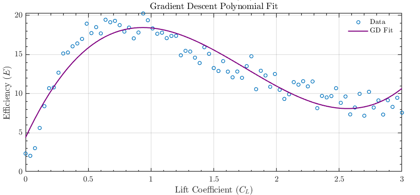

# 🧠 Modeling in Aerospace Engineering Repository

This repository contains the laboratory assignments for **Modeling in Aerospace Engineering** in the **Aerospace Engineering program** at **Universidad Carlos III de Madrid (UC3M)**. It includes problem-solving approaches, MATLAB scripts, and numerical analysis reports designed to bridge theory with computational implementation.

---

## Table of Contents

- [📁 Repository Structure](#-repository-structure)
- [📂 Project Descriptions](#-project-descriptions)
  - [Assignment I – Solving Linear Systems: Direct and Iterative Methods](#assignment-i--solving-linear-systems-direct-and-iterative-methods)
    - [Main Objectives](#main-objectives)
    - [Methods Covered](#methods-covered)
    - [Key Results](#key-results)
    - [How to Run the Code](#how-to-run-the-code)
    - [Visualization Example](#visualization-example)
  - [Assignment II – Aerodynamic Efficiency Curve Modeling](#assignment-ii--aerodynamic-efficiency-curve-modeling)
    - [Main Objectives](#main-objectives-1)
    - [Methods Covered](#methods-covered-1)
    - [Key Results](#key-results-1)
    - [How to Run the Code](#how-to-run-the-code-1)
    - [Visualization Example](#visualization-example-1)
  - [Assignment III – Restricted Three-Body Problem Analysis](#assignment-iii--restricted-three-body-problem-analysis)
    - [Main Objectives](#main-objectives-2)
    - [Methods Covered](#methods-covered-2)
    - [Key Results](#key-results-2)
    - [How to Run the Code](#how-to-run-the-code-2)
    - [Visualization Example](#visualization-example-2)
- [🚀 How to Use](#-how-to-use)
- [🛠️ Requirements](#-requirements)
- [📦 Download as .zip](#-download-as-zip)
- [👥 Authors](#-authors)
- [📘 Course Information](#-course-information)
- [🤝 Contribution](#-contribution)
- [📄 License](#-license)

---

## 📁 Repository Structure

```
.
├── Assignment I - Linear System Solvers/
│   ├── Matrices/
│   │   ├── A1.mat
│   │   ├── A2.mat
│   │   ├── b1.mat
│   │   └── b2.mat
│   ├── Ass_I_Modeling.pdf
│   ├── Best_Omega.m
│   ├── cg.m
│   ├── Config.m
│   ├── Descent.m
│   ├── Gauss_Seidel.m
│   ├── jacobi.m
│   ├── LU_gauss_1.m
│   ├── LUpiv_gauss_2.m
│   ├── Main.m
│   ├── precond_cg.m
│   ├── SOR.m
│   └── substitution.m
├── Assignment II - Aerodynamics Efficiency Curve/
│   ├── Ass_II_Modeling.pdf
│   ├── Config.m
│   ├── data.mat
│   ├── LSfit.m
│   ├── Main.m
│   └── minError.m
├── Assignment III - Restricted Three Body Problem/
    ├── codes/
    │   ├── Config.m
    │   ├── ItdeltaT.m
    │   ├── Iterative_Lambda.m
    │   ├── ODEexplicitEuler.m
    │   ├── ODErk4.m
    │   ├── Output.m
    │   ├── rk4_results.mat   
    │   └── Main.m
    └── Ass_III_Modeling.pdf

```

---

## 📂 Project Descriptions

### 1. Assignment I – Solving Linear Systems: Direct and Iterative Methods

This assignment focuses on analyzing and solving large linear systems using both **direct methods** (e.g., LU decomposition) and **iterative methods** (e.g., Jacobi, Gauss-Seidel, SOR, Gradient Descent, Conjugate Gradient). Implemented in MATLAB, the objective is to evaluate the efficiency, accuracy, and convergence behavior of each method.

#### Main Objectives:

- To solve a linear system using **LU decomposition** with and without pivoting.
- To compare the performance of **iterative solvers**: Jacobi, Gauss-Seidel, and **Successive Over-Relaxation (SOR)**.
- To analyze the behavior of **non-stationary methods**, such as **Gradient Descent** and **Conjugate Gradient** (with and without preconditioning).
- To visualize and interpret the **evolution of the residual norm** across iterations.
- To identify conditions for convergence using **spectral radius** and **matrix properties**.

#### Methods Covered

- **LU Decomposition** (with Gaussian Elimination and Partial Pivoting)
- **Jacobi Iteration**
- **Gauss-Seidel Iteration**
- **SOR Method** (Optimal ω determined by minimizing ρ(T))
- **Gradient Descent**
- **Conjugate Gradient** with Preconditioning

#### Key Results

- Pivoting drastically improved LU decomposition accuracy, reducing the residual from `1e-3` to `~1e-15`.
- Jacobi failed to converge due to lack of diagonal dominance.
- Gauss-Seidel and SOR converged in ~33 iterations; optimal ω ≈ 1.04.
- Preconditioned Conjugate Gradient outperformed all methods with **~27 iterations**.
- Plots of residual norm vs. iteration reveal linear vs. zigzag convergence behavior depending on method.

#### How to Run the Code

1. Open the folder `MATLAB_scripts/` and run each `.m` file in MATLAB.
2. Make sure matrices `A1`, `A2`, and vectors `b1`, `b2` are defined (or loaded) in the workspace.
3. Use `residual_plot.m` to visualize convergence performance across methods.

#### Visualization Example

<p align="center">
  
</p>

---

📌 *All methods and analysis are explained in detail in* [`Ass_1_Modeling.pdf`](Assignment_I_HALE_for_an_UAV/Ass_I_Modeling.pdf).

### Assignment II – Aerodynamic Efficiency Curve Modeling

This assignment focuses on modeling the aerodynamic efficiency curve \( E = f(C_L) \) for the Airbus A320 using a 3rd-degree polynomial fit to experimental wind tunnel data. Implemented in MATLAB, the objective is to compare the **Least Squares (LS)** method and **Gradient Descent (GD)** with weak line search for polynomial fitting, evaluating their accuracy and coefficient consistency.

#### Main Objectives:

- To fit a 3rd-degree polynomial \( E = c_0 + c_1 C_L + c_2 C_L^2 + c_3 C_L^3 \) to the dataset using the **Least Squares** method via normal equations.
- To fit the same polynomial by minimizing the squared error function using **Gradient Descent** with weak line search.
- To compare the polynomial coefficients obtained from both methods.
- To visualize the fitted polynomials overlaid on the experimental data.
- To discuss the equivalence of the methods and their relation to solving normal equations.

#### Methods Covered

- **Least Squares Polynomial Fitting**: Solves the normal equations using MATLAB’s backslash operator (`\`) to find coefficients \( \boldsymbol{x} = [c_0, c_1, c_2, c_3]^T \).
- **Gradient Descent with Weak Line Search**: Minimizes the error function \( \varepsilon(c_0, c_1, c_2, c_3) = \sum_{i=1}^N (c_0 + c_1 C_{Li} + c_2 C_{Li}^2 + c_3 C_{Li}^3 - E_i)^2 \) using an iterative approach with a tolerance of \( 10^{-1} \) and maximum iterations of \( 10^6 \).
- **Visualization**: Plots the fitted polynomials against the dataset to assess fit quality.
- **Coefficient Comparison**: Analyzes differences in coefficients between LS and GD methods.

#### Key Results

- Both LS and GD methods produced polynomials that closely fit the experimental data, as shown in Figures 1 and 2.
- Coefficient differences between LS and GD were on the order of \( 10^{-2} \), indicating near-equivalence.
- LS provided a direct, exact solution via normal equations, while GD offered an iterative alternative with comparable accuracy.
- Plots of the fitted polynomials overlaid on the dataset confirmed successful approximations.
- Execution times: LS method took 0.000429 seconds, while GD (with tolerance \( 10^{-4} \)) took 3.414161 seconds, increasing to 7.463202 seconds at tolerance \( 10^{-6} \).

#### How to Run the Code

1. Open the folder `MATLAB_scripts/` and ensure the dataset `data.mat` is in the MATLAB workspace.
2. Run the main script `main.m` to execute both `LSfit.m` and `minError.m` functions.
3. The script will generate two plots: one for the LS fit and one for the GD fit, with polynomial coefficients displayed in the command window.
4. Use the provided `data.mat` file to reproduce the results.

#### Visualization Example

<p align="center">
  
  
</p>

---

📌 *All methods and analysis are explained in detail in* [`Ass_II_Modeling.pdf`](Assignment_II_Aerodynamic_Efficiency_Curve/Ass_II_Modeling.pdf).

### Assignment III – Restricted Three-Body Problem Analysis

This assignment focuses on numerically solving the Restricted Three-Body Problem (RTBP) for the motion of a third body (Moon) under the gravitational influence of two massive bodies (Earth and Sun) in a rotating reference frame. Implemented in MATLAB, the objective is to compare the **Explicit Euler** and **Runge-Kutta 4 (RK4)** methods for solving the RTBP equations, analyze stability, and evaluate trajectory accuracy.

#### Main Objectives:

- To transform the RTBP equations into a linear system of ordinary differential equations (ODEs) for the state vector \( \boldsymbol{X} = [u_1, u_1', u_2, u_2']^T \).
- To analyze the eigenvalues of the system matrix and determine a stable time step \( \Delta t^* \) for the Explicit Euler method.
- To solve the RTBP using the Explicit Euler method and visualize the temporal evolution of the state vector and the trajectory.
- To solve the RTBP using the RK4 method with the same time step and compare the results.
- To find the largest stable time step for RK4 and compare it with the Explicit Euler method’s time step.
- To evaluate the stability and accuracy of both methods near critical points \( (-\mu, 0) \) and \( (\hat{\mu}, 0) \).

#### Methods Covered

- **Transformation to Linear System**: Convert the RTBP equations into a system of ODEs with state vector \( \boldsymbol{X} \), matrix \( \mathbf{A} \), and vector \( \boldsymbol{B} \).
- **Eigenvalue Analysis**: Compute eigenvalues of \( \mathbf{A} \) using MATLAB’s `eig` function and adjust \( \Delta t^* \) to ensure stability for Explicit Euler.
- **Explicit Euler Method**: Solve the RTBP equations with a stable \( \Delta t^* \), plotting state variables and trajectory.
- **Runge-Kutta 4 (RK4) Method**: Solve the RTBP with the same \( \Delta t^* \) and compare trajectories with Explicit Euler.
- **Time Step Optimization for RK4**: Increase \( \Delta t^* \) by factors of 2 to find the largest stable time step for RK4.
- **Stability and Accuracy Comparison**: Analyze the stability and accuracy of both methods, especially near singularity points.

#### Key Results

- The RTBP equations were transformed into a linear system, but non-linear terms \( D_1 \) and \( D_2 \) persisted due to gravitational forces.
- Eigenvalue analysis revealed purely imaginary eigenvalues, requiring a very small \( \Delta t^* \) for Explicit Euler stability, as the stability region only touches the imaginary axis at the origin.
- Explicit Euler with a stable \( \Delta t^* \) produced bounded state variable evolution and a trajectory similar to the analytical solution, with minor errors near critical points due to first-order approximation.
- RK4 with the same \( \Delta t^* \) showed tighter loops and higher accuracy near critical points, as expected from its fourth-order precision.
- The largest stable \( \Delta t \) for RK4 was found to be 0.001953, significantly larger than the stable \( \Delta t^* \) for Explicit Euler, due to RK4’s broader stability region including parts of the imaginary axis.
- Explicit Euler with the larger \( \Delta t \) (0.001953) was unstable, producing unbounded trajectories, confirming its sensitivity to time step size.

#### How to Run the Code

1. Open the folder `MATLAB_scripts/` and ensure the main script and functions are in the MATLAB workspace.
2. Run the main script `main.m` to execute the Explicit Euler and RK4 solvers, eigenvalue analysis, and visualization functions.
3. The script generates plots for:
   - Eigenvalues in the complex plane with the Explicit Euler stability region.
   - Temporal evolution of state variables \( u_1, u_1', u_2, u_2' \).
   - Trajectories in the \( xy \)-plane for both methods.
4. No user inputs are required; results match those in the report.

#### Visualization Example

<p align="center">
  
  
</p>

---

📌 *All methods and analysis are explained in detail in* [`Ass_III_Modeling.pdf`](Assignment_III_Restricted_Three-body_Problem/Ass_III_Modeling.pdf).

## 🚀 How to Use
1. Clone the repository:
   ```bash
   git clone https://github.com/Himalia13/Modeling-Homework-Assignments-from-Aerospace-Engineering-UC3M
   ```
2. Navigate to the project of interest and open the .m files in MATLAB to run the simulations.

3. Review the PDFs to understand the theoretical framework and the results.

4. Each laboratory session contains:
- A PDF report with theoretical background, methodology, and results
- Source code for data analysis and visualization


## 🛠️ Requirements

- MATLAB (for data analysis and plotting)

## 📦 Download as .zip
If you prefer, you can download the entire repository as a .zip file:

1. Visit the repository page in GitHub.
2. Click the green **Code** button.
3. Select **Download ZIP** and extract the contents to your local directory.


## 👥 Authors

Different laboratory sessions were completed by various student groups from the Aerospace Engineering program at UC3M, including:
- Sergio Viejo Casado
- Andrés Velázquez Vela


## 📘 Course Information

- **Institution**: Universidad Carlos III de Madrid (UC3M)
- **Program**: Aerospace Engineering
- **Course**: Modeling
- **Academic Year**: 2024-2025

## 🤝 Contribution
Contributions are welcome. If you want to add or improve a simulation, create a pull request or open an issue to discuss it.

## 📄 License
This project is free to use, modify, and distribute without restrictions.


